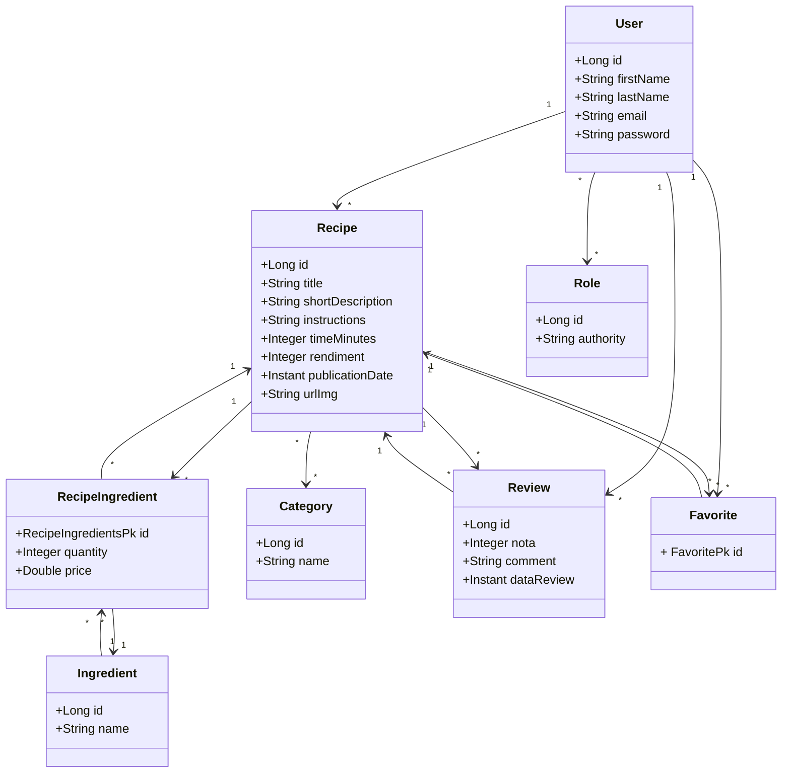

#  Site receitas culinárias


</p>

## Objetivo do projeto

- Sistema em que usuários podem postar, interagir, comentar e engajar receitas culinárias.
- Foco de aplicar conhecimentos e construir um Backend robusto e seguro. Utilizando conceitos que aprendi em treinamentos.
- Construido do zero a partir de uma ideia e regras de negócio que imaginei como uma demanda real.

---

## 📊 Diagrama de Classes



## Tecnologias Utilizadas

- Java 21
- Spring Boot
- GitHub Actions pro CI/CD
- PostgreSQL
- Docker
- JUnit
- Mockito
- Swagger

---

## Minhas principais implementações e aprendizados nesse projeto

- API Rest completa com tratamento de exceções robusto e validações respeitando as regras de negócio
- CI/CD garantindo testes unitários, build do projeto e publish no Docker Hub.
- Implementação de testes unitários cobrindo as regras de negócio principais, atigindo 90% de codigo coberto por testes.
- Arquitetura em camadas bem definidas (controller, service, repository)
- Otimização e performance das consultas ao banco de dados, melhorando problema das N+1.
- Documentação da aplicação com Swagger/OpenAPI para consumo.  
- Uso de commits semânticos, e versionamento do projeto com Git, trabalhando em branchs para features. 


## Relatório JaCoCo para cobertura de testes


---

## Teste a aplicação:

### Requisitos
- Docker
- Postman (opcional)


```bash
# Clone o repositório
git clone https://github.com/gustavokowallski/Receita-Culinaria-api.git
cd Receita-Culinaria-api

# Suba os containers
docker compose up

```

### Consumindo API

##  Credenciais de Teste

### 👑 Admin
```bash
email: admin@gmail.com  
senha: 123456
```
### 👤 User
```bash
email: user@gmail.com    
senha: 123456
```
---

#### Testes via Postman

- **Coleção completa de endpoints + variáveis de ambiente:**  
  [](https://nawszera.postman.co/workspace/nawszera's-Workspace~ea6779bc-203d-4c77-8395-e87a3f1091fa/collection/45108000-4940dac4-9643-4a53-b591-5ad13ab61698?action=share&creator=45108000&active-environment=45108000-ee357952-f911-405a-9337-066beac8e080)


#### Ou via Swagger no navegador!

- Acesse a interface interativa da API:  
  [](http://localhost:8080/swagger-ui/index.html)

- Utilize o botão **Authorize** para inserir o token OAuth2 e testar rotas protegidas (necessário obter o token pelo Postman).

---

### Visão geral do projeto:

- Esse projeto foi um marco na minha carreira como Desenvolvedor pois foi a primeira vez que eu criei algo robusto do zero, seguindo regras de negócio que eu mesmo defini e tirei a ideia do papel para o código.

- Apesar de não seguir as melhores práticas, esse projeto me fez refletir bastante e obter mais maturidade, principalmente pensando em legibilidade e decisões que impactam no projeto.


## 🐳 Docker Hub caso queira conferir

[](https://hub.docker.com/repository/docker/nawszera/minhareceita)

<p>
  <a href="https://www.linkedin.com/in/gustavokowalski/" target="_blank" style="margin-right: 20px;">
    
  </a>

</p>


