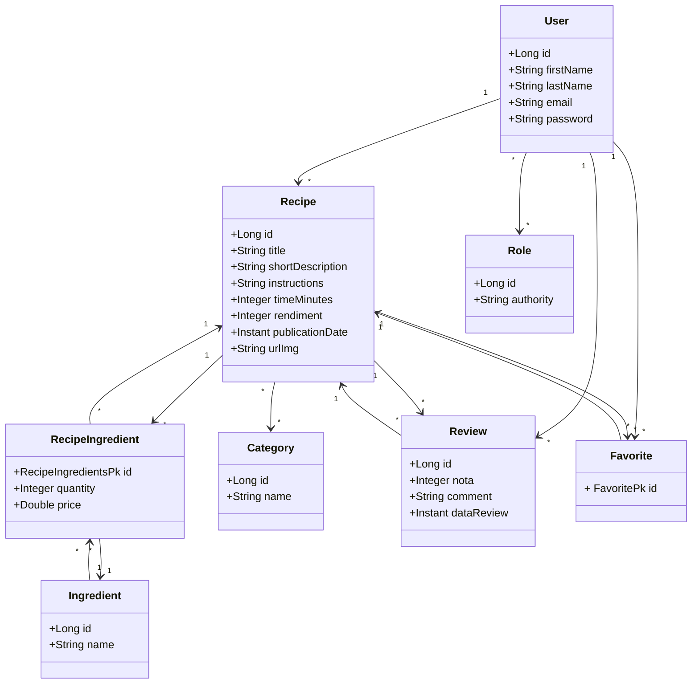

#  Shared Recipes


**SharedRecipes** é uma API RESTful para gestão de receitas culinárias com autenticação, controle de permissões, sistema de favoritos e reviews, construída com foco em código limpo, regras de negócio reais e boas práticas de backend.  
Idealizado como um desafio técnico completo, o projeto simula um ambiente real de desenvolvimento robusto.

---


## 📌 Problema Resolvido

O SharedRecipes nasceu da necessidade de ter um lugar organizado para salvar e compartilhar receitas com outras pessoas. Em vez de depender de anotações soltas ou mensagens no WhatsApp, a ideia foi criar um espaço onde qualquer usuário possa registrar suas receitas com todos os detalhes, receber avaliações e favoritar pratos de outros.

Além disso, o sistema garante que cada ação — como editar ou deletar conteúdo — seja feita apenas pelo dono, mantendo tudo seguro e organizado. É uma aplicação que transforma o hábito de cozinhar em uma experiência digital simples, útil e colaborativa.

---

## 🧠 Visão Geral da Solução

O sistema SharedRecipes entrega:

- Cadastro de receitas com ingredientes, categorias e imagem  
- Sistema de favoritos e reviews entre usuários autenticados  
- Autenticação robusta com JWT + OAuth2  
- Controle de acesso por perfil (usuário comum x admin)  
- Validação rigorosa para criação, edição e exclusão de dados  
- Rotas protegidas: só o autor pode modificar seu conteúdo  
- Backend seguro, testado, versionado e pronto para produção via Docker

---

##  Diagrama de Classes



---


## 🏆 Conquistas e Aprendizados Técnicos

Este projeto simula um backend real de produção. Os principais diferenciais:

✅ CI/CD com GitHub Actions + DockerHub  
✅ Arquitetura em camadas com foco em Clean Code  
✅ Tratamento global de exceções  
✅ 100% de cobertura de testes com JUnit e Mockito  
✅ Segurança robusta com OAuth2 + JWT  
✅ Persistência com PostgreSQL via JPA  
✅ Documentação interativa com Swagger
✅ Melhor uso do Git e branchs para diferentes implementações
✅ Melhor uso do Git e branchs para diferentes implementações

---

## 📦 Tecnologias Utilizadas

| Tecnologia / Prática | Justificativa |
|----------------------|----------------|
| **Java 21 + Spring Boot** | Backend robusto e moderno |
| **Spring Security + OAuth2 + JWT** | Autenticação stateless com roles |
| **BCrypt** | Criptografia de senhas confiável |
| **PostgreSQL + Spring Data JPA** | Persistência relacional eficiente |
| **Docker + Docker Compose** | Ambiente isolado e reprodutível |
| **GitHub Actions** | CI/CD integrado no fluxo de trabalho |
| **Swagger/OpenAPI** | API interativa e auto-documentada |
| **JUnit 5 + Mockito** | Testes de unidade completos |


---

## 🧭 Endpoints da API

### 🍽️ Receitas (Recipes)
- `GET /recipes` — Listar receitas (filtros: categoria, ingrediente, título)  
- `GET /recipes/{id}` — Buscar receita por ID  
- `POST /recipes` — Criar nova receita  
- `PATCH /recipes/{id}` — Atualizar receita *(somente autor)*  
- `DELETE /recipes/{id}` — Deletar receita *(somente autor)*  

---

### 🧂 Ingredientes (Ingredients)
- `GET /ingredients` — Listar ingredientes (com filtro por nome)  
- `POST /ingredients` — Criar novo ingrediente *(admin)*  
- `PUT /ingredients/{id}` — Atualizar ingrediente *(admin)*  
- `DELETE /ingredients/{id}` — Remover ingrediente *(admin)*  

---

### 🗂️ Categorias (Categories)
- `GET /categories` — Listar todas as categorias  
- `POST /categories` — Criar nova categoria *(admin)*  
- `DELETE /categories/{id}` — Remover categoria *(admin)*  

---

### ⭐ Favoritos (Favorites)
- `POST /favorites/{recipeId}` — Favoritar uma receita  
- `DELETE /favorites/{recipeId}` — Remover dos favoritos  
- `GET /favorites/me` — Listar favoritos do usuário logado  

---

### 🧪 Avaliações (Reviews)
- `POST /reviews/{recipeId}` — Criar avaliação para uma receita  
- `GET /reviews/{recipeId}` — Listar avaliações da receita  
- `PUT /reviews/{id}` — Editar avaliação *(somente autor)*  
- `DELETE /reviews/{id}` — Deletar avaliação *(somente autor)*  

---

### 👤 Usuário (User)
- `POST /users` — Criar novo usuário  
- `GET /users/me` — Buscar dados do usuário logado  
- `GET /users/{id}` — Buscar outro usuário *(admin ou para perfil público)*  

---

### 🔐 Autenticação (Auth)
- `POST /oauth2/token` — Obter token JWT com client credentials  
- **Swagger Authorize** — Testar endpoints protegidos via OAuth2  

---


## 🚀 Próximas Funcionalidades

- 📸 Upload de imagens nas receitas  
- 🏆 Ranking de usuários mais engajados  
- 🔔 Notificações para novos reviews e favoritos

---


## ⚙️ Como Rodar o Projeto (Docker)

### 🛠️ Pré-requisitos

[](https://www.docker.com/products/docker-desktop)
[](https://git-scm.com/)

### Passos

```bash
# Clone o repositório
git clone https://github.com/gustavokowallski/SharedRecipes.git
cd SharedRecipes

# Suba os containers
docker compose up

```

### 🌐 Acesso à Aplicação

[](http://localhost:8080)  
[](http://localhost:8080/swagger-ui/index.html)


---

## 📬 Testando a API

### ✅ Via Postman (Recomendado)

- **Coleção de endpoints + variáveis de ambiente:**  
  [](https://nawszera.postman.co/workspace/nawszera's-Workspace~ea6779bc-203d-4c77-8395-e87a3f1091fa/collection/45108000-4940dac4-9643-4a53-b591-5ad13ab61698?action=share&creator=45108000&active-environment=45108000-ee357952-f911-405a-9337-066beac8e080)

### 📖 Via Swagger

[](http://localhost:8080/swagger-ui/index.html)

- Utilize o token OAuth2 no botão **Authorize** para testar rotas protegidas

---

## 🔐 Credenciais de Teste

### 👑 Admin
```bash
email: admin@gmail.com  
senha: 123456
```
### 👤 User
```bash
email: user@gmail.com    
senha: 123456
```
---
.
#  Imagem Docker Pública

[](https://hub.docker.com/repository/docker/nawszera/minhareceita)

### **Autor**

**Gustavo Eiji Kowalski Hatada**
[](https://www.linkedin.com/in/gustavokowalski/)

---
