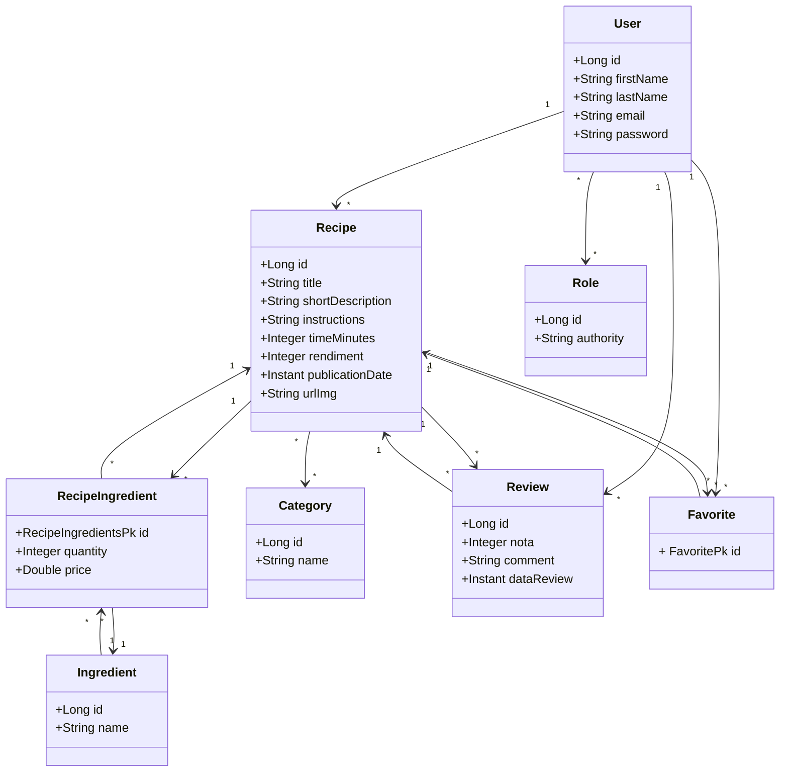

#  API REST de Receitas Culinárias - SharedRecipes

Aplicação para gerenciamento de receitas culinárias, com autenticação JWT + OAuth2, sistema de favoritos, avaliações, controle de permissões e cobertura de testes. Idealizado como um projeto real de backend completo e seguro.

<p align="center">
  <a href="https://skillicons.dev">
    
  </a>
</p>
<p align="center">
  <!-- Build Status -->
  
  
  <!-- Cobertura de Testes -->
  


</p>

## Visão Geral do projeto

O SharedRecipes nasceu da necessidade de ter um lugar organizado para salvar e compartilhar receitas com outras pessoas. Em vez de depender de anotações soltas ou mensagens no WhatsApp, a ideia foi criar um espaço onde qualquer usuário possa registrar suas receitas com todos os detalhes, receber avaliações e favoritar pratos de outros.

Além disso, o sistema garante que cada ação — como editar ou deletar conteúdo — seja feita apenas pelo dono, mantendo tudo seguro e organizado. É uma aplicação que transforma o hábito de cozinhar em uma experiência digital simples, útil e colaborativa.

---

##  Visão Geral da Solução

- Cadastro de receitas com ingredientes, categorias e imagem  
- Sistema de favoritos e reviews entre usuários autenticados  
- Autenticação robusta com JWT + OAuth2  
- Controle de acesso por perfil (usuário comum x admin)  
- Validação rigorosa para criação, edição e exclusão de dados  
- Rotas protegidas: só o autor pode modificar seu conteúdo  
- Backend seguro, testado, versionado e pronto para produção via Docker

---

## 📦 Tecnologias Utilizadas

| Tecnologia / Prática                  | Justificativa                                 |
|--------------------------------------|-----------------------------------------------|
| **Java 21 + Spring Boot**            | Backend moderno, robusto e produtivo          |
| **Spring Security + OAuth2 + JWT**   | Autenticação stateless com controle de roles  |
| **BCrypt**                           | Criptografia segura de senhas                 |
| **PostgreSQL + Spring Data JPA**     | Persistência relacional eficiente             |
| **Docker + Docker Compose**          | Ambientes isolados, portáveis e escaláveis    |
| **GitHub Actions**                   | Pipeline CI/CD automatizada                   |
| **Swagger/OpenAPI**                  | Documentação clara e interativa da API        |
| **JUnit 5 + Mockito**                | Testes confiáveis e de fácil manutenção       |


## 📊 Diagrama de Classes




---

## 🏆 Conquistas Técnicas

- CI/CD completo com GitHub Actions + DockerHub ✔️
- Arquitetura em camadas com foco em Clean Code ✔️ 
- Tratamento global de exceções centralizado ✔️  
- 100% de cobertura de testes automatizados (JUnit 5 + Mockito) ✔️  
- Segurança robusta com autenticação OAuth2 + JWT ✔️  
- Persistência com PostgreSQL via Spring Data JPA ✔️  
- Documentação interativa gerada com Swagger/OpenAPI ✔️  
- Uso estratégico de branches e boas práticas de versionamento Git ✔️  

---

## Execução Local

### Requisitos

<p align="left">
  <a href="https://www.docker.com/">
    
  </a>
  <a href="https://www.postman.com/">
    
  </a>
</p>

### Passos

```bash
# Clone o repositório
git clone https://github.com/gustavokowallski/SharedRecipes.git
cd SharedRecipes

# Suba os containers
docker compose up

```

### ✅ Testes via Postman

- **Coleção completa de endpoints + variáveis de ambiente:**  
  [](https://nawszera.postman.co/workspace/nawszera's-Workspace~ea6779bc-203d-4c77-8395-e87a3f1091fa/collection/45108000-4940dac4-9643-4a53-b591-5ad13ab61698?action=share&creator=45108000&active-environment=45108000-ee357952-f911-405a-9337-066beac8e080)


### 🧾 Documentação via Swagger UI

- Acesse a interface interativa da API:  
  [](http://localhost:8080/swagger-ui/index.html)

- Utilize o botão **Authorize** para inserir o token OAuth2 e testar rotas protegidas.

---

##  Credenciais de Teste

### 👑 Admin
```bash
email: admin@gmail.com  
senha: 123456
```
### 👤 User
```bash
email: user@gmail.com    
senha: 123456
```
---

##  Simulação de Vaga

**Descrição da vaga (simulação):**  

> Buscamos desenvolvedor Java com experiência em construção de APIs REST seguras, autenticação com JWT/OAuth2, versionamento com Git e boas práticas de testes automatizados.

**Minha entrega:**  
Implementei uma API REST completa para gerenciamento de receitas, com autenticação robusta (JWT + OAuth2), controle de permissões por perfil, CI/CD com GitHub Actions e 100% de cobertura de testes automatizados com JUnit 5 e Mockito.  
A aplicação foi totalmente conteinerizada com Docker, preparada para produção e validada com testes manuais e automatizados via Postman e Swagger.


## 🐳 Imagem Docker Pública

[](https://hub.docker.com/repository/docker/nawszera/minhareceita)

📬 **Conecte-se comigo:**  
[LinkedIn](https://www.linkedin.com/in/gustavokowalski/) | [Email](mailto:kkowalskigustavo@gmail.com)


